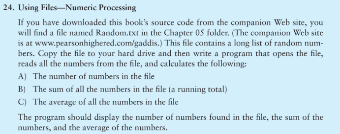

# Chapter 5 C++ COSC 1336

## Using Files-Numeric Processing

This file consists a long list of random numbers. Copy the file to your hard drive and then write a program that opens the file, reads all the numbers from the field, and calculate the following:

*  The number of numbers in the file
* The sum of all the numbers in the file (a running total)
* The average of all the numbers in the file

The program should display the number of numbers found in the field, the sum of the numbers, and the average of the numbers.

